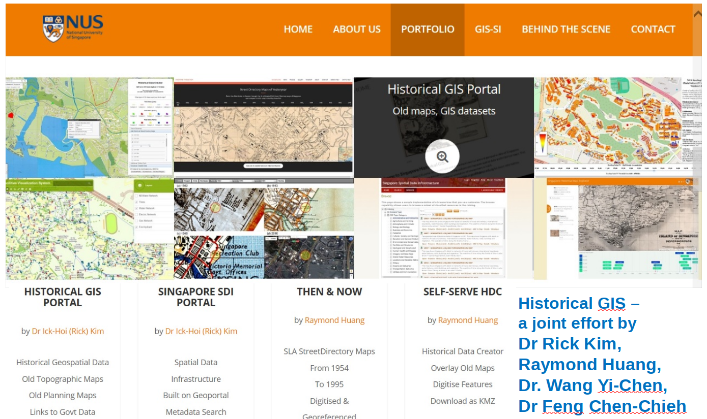
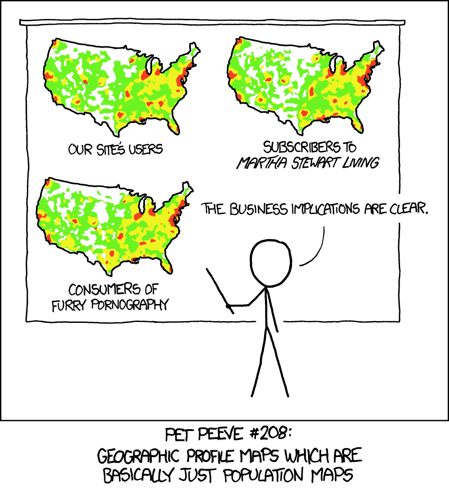

slide_title: Week 01 - Introduction
custom_css: remarkjs/Catppuccin.css
aspect_ratio: 16:9
remarkjs_path: remarkjs/remark-0.15.0.js
use_mathjax: true
use_mermaid: false
add_sidebar: true
add_searchbar: true
use_click: false
use_scroll: false

name: inverse
layout: true
class: center, middle, inverse
---
# 01. Course Introduction and Thematic Mapping
 

.x-large.bold[Dr. FENG Chen-Chieh]  
.x-large.bold[Dr. CHIN Wei Chien Benny] (.italic[week 1 -- week 3])  
[.underline[wcchin@nus.edu.sg]]  
.large.bold[TA: Xu Dong] [.underline[xu.dong@u.nus.edu]]

.footnote.wide[2024-01-16 Department of Geography]
.headnote.wide.bold[GE3252 Cartography and Geovisualization]

---
layout: false
class: left, middle
## Objectives of this lecture
- To know who is teaching this module
- To be aware of the course requirements
- To understand the differences between general purpose maps and thematic maps
- To comprehend the factors for map design

---
class: center, middle, inverse

## Our Research Interests
------
.wide[GIS and remote sensing .dot[] GIScience .dot[] Spatial Humanity]  

---
class: center, middle

### A/Prof FENG Chen-Chieh's Research Interests
GIS and remote sensing applications | GIScience | Spatial Humanity  
  
Smart Campus (City) and 3D Spatial Information

---
class: center, middle

### A/Prof FENG Chen-Chieh's Research Interests
GIS and remote sensing applications | GIScience | Spatial Humanity  
  
Deep Learning Model for Urban Functional Zone Classification

---
class: center, middle

### A/Prof FENG Chen-Chieh's Research Interests
GIS and remote sensing applications | GIScience | Spatial Humanity  
  
Exploratory Data Analysis in Social Cultural Geography  
https://shgis.nus.edu.sg/chinese-temples/

---
class: center, middle

### A/Prof FENG Chen-Chieh's Research Interests
GIS and remote sensing applications | GIScience | Spatial Humanity  
  

---
class: left, middle

.split-30[.column[
### Dr. Benny Chin's Research Interests
GIScience |  
Spatial Patterns |  
Complex Networks  
].column[
  
]]

---
class: center, middle, inverse
## Course Introductions and Policies
------
.wide[Overview .dot[] Topics .dot[] Assessment .dot[] Policies]

---
class: left, middle

.split-20[.column[
### Course introductions
see CANVAS for details
].column[.justify[
#### 1. Course Overview
This course covers .red.underline[the art, science, and ethics of mapmaking and map use]. It aims to introduce students the design principles and techniques for creating maps with contemporary mapping tools. Topics covered include conceptualisation of geographic phenomena, projection and distortion, geospatial data manipulation and presentation, thematic map design, interactive geographic visualization, and emerging trends in cartography and geovisualisation. The course emphasises effective visual thinking and visual communication with Geographic Information Systems (GIS). It is mounted for students with interests .red.underline[in GIS and map design as a medium for communication].
]]]

---
class: left, middle

.split-20[.column[
### Course introductions
see CANVAS for details
].column[.justify[
#### 5. Topics covered

- .red[Thematic cartography and geovisualisation]
- Geographic Phenomena and map symbolization
- Elements of and distortions on map projections
- Map elements and typography
- Principles of colour
- Choropleth mapping and dasymetric mapping
- Graduate symbol and proportional symbol mapping
- Dot mapping
- Isarithmic mapping
- Trends in cartographic and geovisualisation research and development
]]]

---
class: left, middle

.split-20[.column[
### Assessment and Policies
see CANVAS for details
].column[.justify[
#### 7. Assessment
  
]]]
---
class: left, middle

.split-20[.column[
### Assessment and Policies
see CANVAS for details
].column[.justify[
#### 8. Policies
- .red[[IMPORTANT]] .mark[All teaching materials (e.g., lecture pptx, lab handouts, quizzes, videos) are copyrighted.] Selling or buying such materials is prohibited. If you would like to use the teaching materials for any other purpose (e.g., in your future job for training others), please inform the course coordinator, because the IP rests with faculty. Disciplinary action will be taken should any attempted is found to sell/buy the teaching materials and/or distribute them without the course coordinator's consent. 
- The lab assignments that you submit .mark[must be your OWN work.] Copying other’s files for submission is forbidden. Please refer to NUS Code of Student Conduct and NUS Libraries Guides for what plagiarism is. If you are unsure, speak to the lecturer for clarification.
- If you miss any of the lab sessions or tests, .mark[your assignment/make-up test request will not be accepted and you will get 0 mark for that CA item]. The only exception is you submit an official letter from NUS or government agency where you are involved in during the class time, and this must be done one week before the affected class. 
- Attend the lab session that you are registered in, as there may be questions to submit during the lab session. .mark[Switching lab sessions is not allowed unless approved in advance by the lecturer.]
]]]

---
class: left, middle

.split-20[.column[
### Assessment and Policies
see CANVAS for details
].column[.justify[
#### 8. Policies
- Late submission of assignments will result in .mark[a deduction of 1 mark per day]. No submission will be accepted five days after the due day. You are responsible for submitting the final correct file. Submission of .mark[wrong files/maps will NOT be accepted as an excuse for late submission].
- If there is .mark[any question regarding the marks] that you receive for your lab assignment, please speak to the lecturer/TA in charge. This must be done within three days after the assignment is returned to you. 
- Please .mark[check your NUS email regularly] for any update regarding the course.
- [Guidelines on the Use of AI Tools For Academic Work](https://libguides.nus.edu.sg/new2nus/acadintegrity#s-lib-ctab-22144949-5) and [A General Message to Our Students on the Use of AI Tools](https://libguides.nus.edu.sg/new2nus/acadintegrity#s-lib-ctab-22144949-4):
    - Copy-paste from AI output is considered plagiarism; 
    - Using AI in (self-)learning processes (basic knowledge, proofreading/editing, etc.) is okay;
    - Acknowledging your use of AI;
    - You are responsible for your work. 

#### 9. Reading
Thematic Cartography and Geovisualization, by Slocum et al. 3rd edn. Prior editions are also fine. 
]]]

---
class: center, middle, inverse

## What is Map?
------
.wide[& why do we need it?]

---
class: left, middle
background-image: url(resources/week-01/LotrProject_map1.png)

<h3 class="box-text"> Map? </h3>

.footnote[.small.bold[The Lord of the Ring Map (Map of Middle-Earth) by [LotrProject](http://lotrproject.com/map)]]

---
class: center, top
background-image: url(resources/week-01/game-of-throne-map.png)

<h3 class="box-text"> Map? </h3>

.footnote-right[.small.bold[.white[Game of Thrones Map by ][StoryMapJS](https://storymap.knightlab.com/examples/aryas-journey/)]]

---
class: left, middle

.split-20[.column[
### What these fiction maps tell us?

].column[.justify[
These fiction maps contain:
- the locations of events/scenes
    - relative locations, distances, spatial differences
- a (series of) story line(s)
    - the time dimension 
- interactions between the people
    - social networks

A map is a tool for telling a story, a medium for communicating. 

.footnote-right.xkcd[BTW, fiction maps are not in the course's objective.  
Now let's look at some serious REAL MAP.]
]]]

---
class: center, top
background-image: url(resources/week-01/watercolor_map2.png)

<h3 class="box-text"> Basemap </h3>
<h4 class="box-text"> for online mapping </h4>

<!---->

.footnote[.small.bold[Watercolor map by: [Stamen Design](https://maps.stamen.com/watercolor/#2/15.1/-0.5), [Cooper Hewitt, Smithsonian Design Museum ](https://watercolormaps.collection.cooperhewitt.org/#12/1.3669/103.8013)]]

---
class: left, middle
.split-20[.column[
### SMRT Locality map
#### Chinese Garden Exit C
].column[.center[

.footnote-left[.small.bold[by [SMRT](http://journey.smrt.com.sg/journey/station_info/chinese-garden/map/)]]
]]]

---
class: left, middle
background-image: url(resources/week-01/Snow-cholera-map-1.jpg)

.split-20[.column[
.box[
<h3 class="box-text"> John Snow's 1854 Cholera Map </h3>
<h4 class="box-text"> distribution of cases and water pumps</h4>
]
].column[.justify[
.footnote-left.box2[.small.bold[John Snow's 1854 Cholera Map, see: [Wikipedia](https://en.wikipedia.org/wiki/File:Snow-cholera-map-1.jpg) for description.]]
]]]

---
class: left, middle
.split-20[.column[
### Cholera disease
#### cases, water & sanitation, precipitations.
].column[.justify[

.footnote-left[.small.bold[WHO (2012): [Atlas of Health and Climate](https://www.who.int/publications/i/item/9789241564526).]]
]]]

---
class: left, middle
.split-20[.column[
### COVID-19 2023/12/31
#### weekly comparison 
Our World in Data
].column[.justify[

.footnote-left[.small.bold[by [Our World in Data](https://ourworldindata.org/covid-cases)]]
]]]

---
class: left, middle
.split-20[.column[
### What can we do with maps?
].column[.justify[
- to show locations
- to show directions
- to present spatial distributions
- to identify relationships between datasets
- to monitor and communicate a situation 
]]]

---
class: center, middle
### Beware of How You Explain Maps
.split-50[.column[.center[
  
a comic from [xkcd.com/1138](https://xkcd.com/1138/)
]].column[.center[
  
extracted from book: [How to Lie with Maps](https://press.uchicago.edu/ucp/books/book/chicago/H/bo27400568.html)
]]]

---
class: center, middle, inverse

## Types of Maps
------
.wide[General purpose maps .dot[] Thematic maps .dot[] and others]

---
class: center, middle
### A Clasification of Map Types

  
.footnote.small[Virtual map is not in the scope of this course, for more details, see: [Wikipedia](https://en.wikipedia.org/wiki/Computer_cartography)]

---
class: center, middle
### Mental Map

.split-50[.column[.center[
      
    A map drawn by a 9yo elementary school student, showing how he thinks the way between home and school. 
]].column[.center[
      
    The actual path and map (reference map). 
]]]
.footnote[.small.bold[[Fang and Lin 2017](https:doi.org/10.1177/0042098016630513), School travel modes and children’s spatial cognition.]]

---
class: right, top
background-image: url(resources/week-01/general_purpose_map.jpg)

.box[
<h3 class="box-text"> General Purpose Map / Reference Map </h3>
<h4 class="box-text"> to show locations and directions </h4>
]
### 
.footnote-right[.small.bold[Historical Maps of Singapore [NUS Libraries](https://libmaps.nus.edu.sg/)]]

---
class: left, bottom
background-image: url(resources/week-01/world_map_of_social_networks.png)

.box[
<h3 class="box-text"> Qualitative Map </h3>
<h4 class="box-text"> to show the spatial distribution of categorical data</h4>
]
### 
.footnote-left[.small.bold[World Map of Social Networks, by [Vincos](https://vincos.it/world-map-of-social-networks/)]]

---
class: right, top
background-image: url(resources/week-01/happiness_map3.png)
.split-80[.column[.center[]].column[
### Quantitative Map
#### Single variable
to display the spatial aspects of numerical data: ordinal, interval, ratio scale
 
 
 
 
 
 
.small.bold[Global Happinness Index 2023 [Visual Capitalist](https://www.visualcapitalist.com/worlds-happiest-countries-2023/)
]]]

---
class: left, top
background-image: url(resources/week-01/happiness_UGS_map2.png)
.split-30[.column[
### Quantitative Map
#### Multiple variable
to compare the spatial strucures of numerical data
]
.column[.align-left[
.footnote[.small.bold[[Kwon et al. 2021](https://doi.org/10.1140/epjds/s13688-021-00278-7), Urban green space and happiness in developed countries.]]
]]]

---
class: left, middle

.split-50[.column[
### Major components of thematic maps

- Base map: 
    - for referencing, 
    - to tell where it is

 
- Thematic overlay: 
    - the main theme, 
    - to tell the patterns
]
.column[.center[

]]]

---
class: center, middle, inverse

## The Purposes of Designing Maps
------
.wide[Geovisualization .dot[] How Maps May Function]

---
class: left, top

.split-30[.column[
### Geovisualization
].column[.align-left[
#### Scientific Visualization
.italic[
> The purpose of scientific computing is .bold[insight] not numbers.
> The goal of visualization is to leverage existing scientific methods by providing .bold[new scientific insight] through .bold[visual methods].
]
.small.bold.italic[see Thematic Cartography and Geovisualization, p.12 & [Visualization in scientific computing](http://www.sci.utah.edu/vrc2005/McCormick-1987-VSC.pdf), p.3]

#### Geographic visualization
.italic[
> Geographic visualization [can be defined] as the use of concrete visual representation ... to .bold[make spatial contexts and problems visible], so as to engage the most powerful human information-processing abilities, those associated with vision.
]
.small.bold.italic[see Thematic Cartography and Geovisualization, p.12]
]]]

---
class: left, top

.split-30[.column[
### Geovisualization
Geovisualization is a series of explorations and analyses, that includes using various techniques and methods, e.g., thematic mapping, exploratory spatial data analysis, to uncover the underlying patterns, to get better understanding of geographical phenomena.
].column[.align-left[
#### MacEachren's cartographic cube

.footnote[.small.bold[see Thematic Cartography and Geovisualization, p.12--15]]

]]]

---
class: left, top

.split-30[.column[
### How Maps May Function?
A five-step process for .red[understanding geographical phenomenon] throught map communication.  
 
Geographical phenomenon,  
--> visualization,  
--> interpretation. 
].column[
#### The communications paradigm for cartography

.footnote[.small.bold[modified from [Sluter 2001](https://doi.org/10.14393/rbcv53n1-43924), New theoretical research trends in cartography.]]
]]

---
class: left, top

.split-30[.column[
### How Maps May Function?
The progress of visualization  
 
Visual Thinking vs.  
Visual Communication
].column[
#### DiBiase's view of visualization and cartography

.footnote[.small.bold[redrawn from [DiBiase 1990](https://www.geovista.psu.edu/publications/others/dibiase90/swoopy.html), Visualization in the earth sciences.]]
]]

---
class: center, middle, inverse

## Planning and Designing Maps
------
.wide[Steps .dot[] Tasks]

---
class: left, middle
.split-30[.column[
### Steps in Thematic Map Design
]
.column[
- Consider what the .red[real-world distribution] of the phenomenon might look like
- Determine the .red[purpose] of the map and the .red[intended audience]
- Collect .red[appropriate data], data preprocessing and modelling
- .red[Design and construct the map]
- Determine whether users find the map .red[useful and informative]
]]

---
class: center, middle

### Tasks in Creating a Thematic Map

Cartographic Abstraction and Generalization

<ul>
<li>Selection</li>
<li>Classification</li>
<li>Simplification</li>
<li>Symbolization</li>
</ul>

---
class: left, top
.split-30[.column[
### Abstraction and Generalization
- .red[Selection]

]
.column[
### Selection
Decision on, for example
- Geographic space (area) to be mapped
    - Where? Geographic extent.
- Map scale
    - The level of details, resolutions, spatial units.
- Map projection
    - Which is more important? distance? area? or direction?
- Data variable for the map's purpose
    - Direct count? density? incidence rate per 1000 people?
- Sampling methods
    - Which one or which sets of example to show?
]]

---
class: left, top
.split-30[.column[
### Abstraction and Generalization
- Selection
- .red[Classification]
]
.column[
### Classification
A process in which objects are placed in groups having identical or similar features

Two types
- Qualitative
    - infected, non-infected
    - candidate-1, candidate-2, ...
    - cluster-1, cluster-2, ...cluster-N
    - industrial, commercial, green space... 
- Quantitative
    - low, middle, high
    - lowest 10%, top 10%...
    - negative, neutral, positive ... 
]]

---
class: left, top
.split-30[.column[
### Abstraction and Generalization
- Selection
- Classification
- .red[Simplification]
]
.column[
### Simplification
- The level of details  

- [Google Maps wipes out Scottish island of Jura](https://blog.geogarage.com/2013/07/google-maps-wipes-out-scottish-island.html)
- [Coastline paradox](https://en.wikipedia.org/wiki/Coastline_paradox)  
  
.small[If the measurement unit approaches zero, then the coastline becomes infinitely long.] 
]]

---
class: left, top
.split-30[.column[
### Abstraction and Generalization
- Selection
- Classification
- Simplification
- .red[Symbolization]
]
.column[
### Symbolization
Using a set of symbols to represent real-world things
- symbols/markers
- colors
- sizes
- widths

]]

---
class: center, middle

## Summary

---
class: left, top
### Thinking exercise: Variable selection
.small[
Let’s say you are drawing a map of disease distribution, and there are two options, direct count or incidence rate. Below is an example of two zones/spatial units within the map: 

Given the population size:
- Zone A: 10k
- Zone B: 1k

.split-50[.column[
At the early stage:

- Zone A: 5 patient
- Zone B: 5 patient

.mark[This indicated a similar severity level between the two zones.]

What if we calculate per 1000 people incidence rate?

- Zone A: 5/10k = 0.0005 = 0.05%
- Zone B: 5/1k = 0.005 = 0.5%

.mark[This suggested 10x differences between the two zones.]
].column[
2 years later, when the disease is everywhere, the number of cases in one week:

- Zone A: 1000 patient
- Zone B: 500 patient

.mark[Zone A doubled the size of Zone B]

The incidence rate (per 1000 people):

- Zone A: 1000/10k = 0.1 = 10% of the population are infected
- Zone B: 500/1k = 0.5 = 50% of the population are infected

.mark[Zone A is less than Zone B]
]]
 
.box[

Which one should be used for the early stage, and which one is more appropriate for the 2 years later situation, and why. Or, is there other better option?

]
]