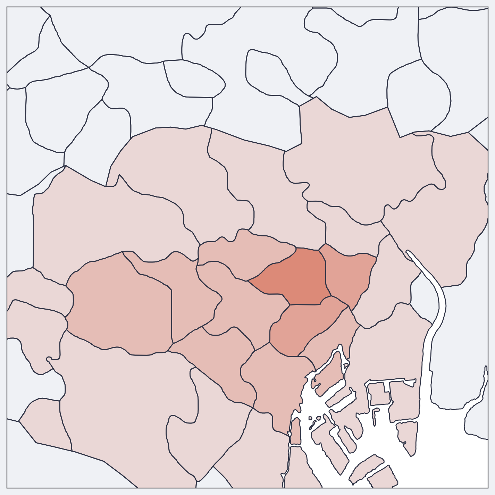
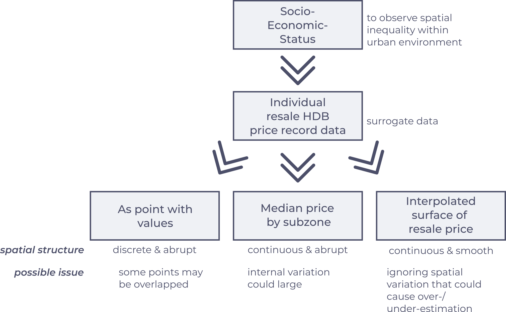

slide_title: Week 02 - Geographic Phenomena & Map Symbolization
custom_css: remarkjs/Catppuccin.css
aspect_ratio: 16:9
remarkjs_path: remarkjs/remark-0.15.0.js
use_mathjax: true
use_mermaid: false
add_sidebar: true
add_searchbar: true
use_click: false
use_scroll: false

name: inverse
layout: true
class: center, middle, inverse
---

# 02. Geographic Phenomena & Map Symbolization
 

.x-large.bold[Dr. FENG Chen-Chieh]  
.x-large.bold[Dr. CHIN Wei Chien Benny] (.italic[week 1 -- week 3])  
.underline[wcchin@nus.edu.sg]

.footnote.wide[2024-01-23 Department of Geography]
.headnote.wide.bold[GE3252 Cartography and Geovisualization]

---
layout: false
class: left, middle

.split-40[.column[
## From Lecture 01
].column[.larger[
- General Purpose Maps vs. Thematic Maps
- Thematic Maps:
    - Base map
    - Thematic overlay
- Tasks in creating a thematic map
]]]

---
class: center, middle
## From Lecture 01

.bold.larger[From Geographic Phenomena to Map Design]

---
layout: false
class: left, middle

.split-30[.column[
## Objectives of this lecture
].column[.larger[
- To understand different models of .bold.red[geographic phenomena]
- To be familiar with the .bold.red[visual variables] for representing geographic phenomena
]]]

---
class: center, middle, inverse

## What are Geographic Phenomena
------
.wide[by Spatial Topics .dot[] by Spatial Dimensions .dot[] by Spatial Structure]

---
class: left, middle

### Geographic Phenomena: Spatial .underline[Topics] 
------
.wide[ Human/Cultural .dot[] Natural/Ecology .dot[] Physical Geography/Earth Science ]

---
class: left, middle

.split-30[.column[
#### .italic.underline[Geographic Phenomena] 
### Spatial .red[Topics] 
#### Human/Cultural-related

.small[source: .bold[NUS Library Initiatives] – [Digital Humanities Project](http://libportal.nus.edu.sg/frontend/ms/sg-chinese-clans/about-sg-chinese-clans)]
].column[

]]

---
class: left, middle

.split-30[.column[
#### .italic.underline[Geographic Phenomena] 
### Spatial .red[Topics] 
#### Human/Cultural-related

].column[

]]

---
class: left, top
background-image: url(resources/week-02/topic_birds.png)

.split-40[.column[
#### .italic.underline[Geographic Phenomena] 
### Spatial .red[Topics] 
#### Natural/Ecology-related
- Top: Black-faced Spoonbill
- Bottom: Bar-tailed Godwit

- Left: Distribution of sighted spots (ebird)
- Right: Migration routes and breeding range (BirdLife)
    
.small[source:  
.bold[BirdLife]: [East Asia/ 
Australasia Flyway](https://datazone.birdlife.org/userfiles/file/sowb/flyways/8_East_Asia_Australasia_Factsheet.pdf),  
.bold[ebird]: [Black-faced Spoonbill](https://ebird.org/species/blfspo1), [Bar-tailed Godwit](https://ebird.org/species/batgod)]
].column[
&nbsp;  
]]

---
class: left, top
background-image: url(resources/week-02/earthquake_shaking.png)

.split-40[.column[
#### .italic.underline[Geographic Phenomena] 
### Spatial .red[Topics] 
#### Physical geography/Earth science-related

The .red[epicenter] and .red[perceived shaking] during the 2011 March 11 Earthquake (Great Sendai earthquake, Great Tōhoku earthquake)

    
.small[source: [Britannica](https://www.britannica.com/event/Japan-earthquake-and-tsunami-of-2011/Relief-and-rebuilding-efforts), Japan earthquake and tsunami of 2011]
].column[
&nbsp;  
]]

---
class: left, bottom
background-image: url(resources/week-02/tsunami_wave_height.png)

.split-40[.column[
.box[
<h4 class="box-text"> Geographic Phenomena </h4>
<h3 class="box-text"> Spatial Topic </h3>
<h4 class="box-text"> Physical geography/Earth science-related</h4>
 Tsunami Wave Height Model 
]
].column[.justify[
.footnote-right.box2[.small.bold[Japan earthquake and tsunami of 2011, see: [Britannica](https://www.britannica.com/event/Japan-earthquake-and-tsunami-of-2011/Relief-and-rebuilding-efforts) for description.]]
]]]

---
class: left, middle

### Geographic Phenomena: Spatial .underline[Dimensions] 
------
.wide[ 0D .dot[] 1D .dot[] 2D .dot[] 2.5D .dot[] 3D ]

---
class: left, top

.split-30[.column[
#### .italic.underline[Geographic Phenomena]
### Spatial .underline[Dimensions] 
- .red[0D: Point]

] .column[

[Full page](resources/week-02/keplergl_earthquake_2023.png)  
2023 Earthquake: Colors: Depth, Size: Magnitude

.footnote-right[Data source: [USGS Earthquake](https://earthquake.usgs.gov/earthquakes/search/)]
]]

---
class: left, top

.split-30[.column[
#### .italic.underline[Geographic Phenomena]
### Spatial .underline[Dimensions] 
- .red[0D: Point]

] .column[

[Full page](resources/week-02/keplergl-SF_StreetTrees.png)  
Street Trees at San Francisco: Colors: Species, Size: Diameter at breast height (DBH)

.footnote-right[Data source: [DataSF, sf.gov](https://data.sfgov.org/City-Infrastructure/Street-Tree-List/tkzw-k3nq/data)]
]]

---
class: left, top

.split-30[.column[
#### .italic.underline[Geographic Phenomena]
### Spatial .underline[Dimensions] 
- 0D: Point
- .red[1D: Line]

] .column[

[Full page](resources/week-02/world_migration_2010-2015.png)
World Migration Map (2010--2015)
.footnote-right[Map Link: [Metrocosm](http://metrocosm.com/global-migration-map.html) Data source: [United Nations Population Devision](https://www.un.org/development/desa/pd/content/international-migrant-stock)]
]]

---
class: left, top

.split-30[.column[
#### .italic.underline[Geographic Phenomena]
### Spatial .underline[Dimensions] 
- 0D: Point
- .red[1D: Line]

] .column[

[Full page](resources/week-02/google_map_traffic.png)  
Typical Traffic (Tuesday 5pm) near Bugis
.footnote-right[Map Link: [Google Map](https://www.google.com/maps/@1.2981283,103.8557098,17.26z/data=!5m1!1e1?entry=ttu)]
]]

---
class: left, top

.split-30[.column[
#### .italic.underline[Geographic Phenomena]
### Spatial .underline[Dimensions] 
- 0D: Point
- 1D: Line
- .red[2D: Areal]

] .column[

[Full page](resources/week-02/Singapore_GE2020.png)  
Singapore General Election 2020, by electoral divisions
.footnote-right[Map Link: [The Straits Times](https://www.straitstimes.com/multimedia/graphics/2020/07/singapore-general-election-ge2020-live-results/index.html)]

]]

---
class: left, top

.split-30[.column[
#### .italic.underline[Geographic Phenomena]
### Spatial .underline[Dimensions] 
- 0D: Point
- 1D: Line
- .red[2D: Areal]

] .column[

[Full page](resources/week-02/URA_MP2019.png)  
Singapore URA Master Plan 2019 (revised: 2 Oct 2023)
.footnote-right[Map Link: [URA Master Plan 2019](https://www.ura.gov.sg/maps/?service=mp)| Data source: [DATA.GOV.SG](https://beta.data.gov.sg/datasets/d_90d86daa5bfaa371668b84fa5f01424f/view)]

]]

---
class: left, top

.split-30[.column[
#### .italic.underline[Geographic Phenomena]
### Spatial .underline[Dimensions] 
- 0D: Point
- 1D: Line
- 2D: Areal
- .red[2.5D: Surface]

Every (X, Y) has a value. 

] .column[

[Full page](resources/week-02/zoomearth_feelslike_temperarure.png)  
Temperature (feels like)
.footnote-right[Map Link: [Zoom Earth](https://zoom.earth/maps/temperature-feel/#view=37.651,131.547,6z/)]
]]

---
class: left, top

.split-30[.column[
#### .italic.underline[Geographic Phenomena]
### Spatial .underline[Dimensions] 
- 0D: Point
- 1D: Line
- 2D: Areal
- .red[2.5D: Surface]

Every (X, Y) has a value. 

] .column[

[Full page](resources/week-02/US-Precipitation-Map.jpg)  
US Precipitation Map
.footnote-right[Map Link: [GIS Geography](https://gisgeography.com/us-precipitation-map/)]
]]

---
class: left, top

.split-30[.column[
#### .italic.underline[Geographic Phenomena]
### Spatial .underline[Dimensions] 
- 0D: Point
- 1D: Line
- 2D: Areal
- 2.5D: Surface
- .red[3D: Real 3D]

Every (X, Y, Z) has a value. 

] .column[

3D model of an open-pit coal mining site.
.footnote-right.small[(page 567, textbook)]

]]

---
class: left, top

.split-30[.column[
#### .italic.underline[Geographic Phenomena]
### Spatial .underline[Dimensions] 
- 0D: Point
- 1D: Line
- 2D: Areal
- 2.5D: Surface
- .red[3D: Real 3D]

Every (X, Y, Z) has a value. 

] .column[

Hurricane Katrina (2005/08/28)
.footnote-right[Map Link: [NASA Scientific Visualization Studio](https://svs.gsfc.nasa.gov/cgi-bin/details.cgi?aid=3218)]

]]

---
class: left, top

.split-40[.column[
#### .italic.underline[Geographic Phenomena]
### Spatial .underline[Dimensions] 
- 0D: Point
- 1D: Line
- 2D: Areal
- 2.5D: Surface
- 3D: Real 3D
- .red[A Note on map scales]
##### The effect of map scale on geographical phenomena
.small[
Two maps of Singapore MRT:
- (a) .red[Small-scale] map: The entire Singapore  
- (b) .red[Large-scale] map: Four stations between Boon Lay to Jurong East

Scale in cartography
- (a) larger area: $\frac{1}{\text{longer}}$ --> smaller --> small scale
- (b) smaller area: $\frac{1}{\text{shorter}}$ --> larger --> large scale

]
] .column[

]]

---
class: left, middle

### Geographic Phenomena: Spatial .underline[Structure] 
------
.wide[ .red[Continuity] .dot[] .red[Smoothness] ]

---
class: left, top

.split-30[.column[
#### .italic.underline[Geographic Phenomena]
### Spatial .red[Continuity] 
#### Discrete vs. Continuous

] .column[
##### Discrete data in Statistics
Discrete numbers (usually a integer)
- The number of students in a class (cannot have half a student)
- The number of cars in a parking lot (cannot have half a car)
- The number of books on a shelf (cannot have half a book)
- Age: Age can be considered discrete or continuous. 
    - days, weeks, minutes, years...
- Rank: Rank is considered discrete most of the time, but can be used as continuous as well (depends on the use case).
- Aggregated groups: age group...

   

> .red[With discrete data, the possible values are distinct and separate, with no values existing between them. This means that there are gaps between the possible values, and it is not possible to have a value that falls between two of the discrete values.]
]]

---
class: left, top

.split-30[.column[
#### .italic.underline[Geographic Phenomena]
### Spatial .red[Continuity] 
#### Discrete vs. Continuous

] .column[
##### Continuous data in Statistics
Continuous numbers (could be any real number)
- Temperature (can be any real number)
- Distance (can be any positive real number)
- Time (can be any positive real number)
    - Epoch time
- Statistically converted values
    - daily average number of visits
    - n-day moving average of cases
    - population density

   

> .red[Continuous data is data that can take on any value within a certain range. It can be subdivided into smaller and smaller units without end.]

]]

---
class: left, top

.split-30[.column[
#### .italic.underline[Geographic Phenomena]
### Spatial .red[Continuity] 
#### Discrete vs. Continuous

] .column[
#### Discrete Phenomena
Spatially separated, nothing falls between the locations.
- Point events: crimes, disease cases (John Snow map)...
- Point locations: MRT station, trees...
- Sparsely spaced: villages in rural area, animal caves...

#### Continuous Phenomena
Spatially adjacent, everything is next to each other. 
- Polygon-based: population size, population density
- Grid-based: kernel density estimation, Kriging interpolation
- Raster-based: NDVI, HSR Imagery, DSM data

]]

---
class: center, middle
#### POI in Tokyo
.split-50[.column[
  
Detail distribution of human activity, that is mainly surrounding the metro stations. 
].column[
  
Spatial distribution of urban vitality at Municipal divisions level. 
]]

---
class: left, top

.split-30[.column[
#### .italic.underline[Geographic Phenomena]
### Spatial .red[Smoothness] 
#### Abrupt vs. Smooth

] .column[

Abrupt and smooth describe the .red[sudden] and .red[gradual] changes, respectively.

#### Abrupt spatial phenomenon
can change a lot immediately between adjacent locations
- accidents, earthquakes
- ethnicity distribution, election (supporting candidate) distribution
- social-economic status

#### Smooth spatial phenomenon
Smooth phenomena: gradually change between adjacent locations
- temperature, precipitation
- population density, habitat suitability, urbanization level
- elevation
]]

---
class: center, middle
#### HDB resale transaction (2022)
.split-50[.column[
  
Prism map of Subzone median value
].column[
  
Meshgrid of IDW interpolation
]]

.footnote[.small[source: [data.gov.sg](https://beta.data.gov.sg/datasets/d_8b84c4ee58e3cfc0ece0d773c8ca6abc/view)]]

---
class: center, middle

### Geographic Phenomena by Spatial Structure 
#### Spatial Continuity & Spatial Smoothness

  

.footnote[.small[(page 78, textbook)]]

---
class: center, middle, inverse

## The Data
------
.wide[Processing of Data .dot[] Types of Data]

---
class: left, middle
.split-30[.column[
### Processing of Data
].column[
  
]]

---
class: left, middle
.split-30[.column[
### Processing of Data
Example of the mapping of socio-economic-status (SES).  

Using different spatial structure representation approach for showing the spatial differences in SES. 
].column[
  
]]

---
class: left, middle
.split-30[.column[
### Processing of Data
Approaches for mapping a data set of percentage of forest cover by county for the state of South Carolina.
- (A) The data are treated as coming from a smooth, continuous phenomenon; 
- (B) the data are treated as an areal phenomenon. 
- (C) Map C illustrates that maps A and B have been rotated 45° from a traditional north-oriented map. 

.footnote-left.small[(page 80, textbook)]
].column[
  
]]

---
class: left, middle
.split-30[.column[
### Types of Data
Levels of Measurement
].column[
- Nominal
    - Qualitative
    - For identification
    - e.g., land cover, service types, regions...
- Ordinal
    - Quantitative
    - For ranking
    - e.g., high/medium/low risk zones, 5-likert scale...
- Interval
    - Quantitative
    - With arbitrary zero (reference point is not an absolute zero)
    - e.g., income group (below 2k, 2k--4k...), Centigrade/Fahrenheit temperature, elevation...
- Ratio
    - Quantitative
    - With non-arbitrary zero (the reference point is an absolute zero)
    - e.g., population by province, crime rate per town, Kelvin temperature
]]

---
class: center, middle

### Types of Data
Levels of Measurement

  

---
class: center, middle, inverse

## Visual Variables
------
.wide[]

---
class: left, middle
.split-40[.column[
### For Quantitative Data
Map symbolization approaches for capturing the differences in values/numbers. 

- Spacing: denser is higher
- Size: larger is higher
- Perspective Height: higher is higher
- Color (Hue)
- Color (Lightness)
- Color (Saturation)

For colors, darker colors indicate higher values. Usually single or two/three hues with similar "temperature" (.red[cool colors], .red[warm colors]) are used. 

].column[
  
]]

---
class: left, middle
.split-40[.column[
### For Qualitative Data
Map symbolization approaches for indicating different types. 

- Orientation
- Shape
- Arrangement
- Color (Hue)

For qualitative/nominal data, all objects are on the same level, no relative high/low relationship between them. Thus, the 4 approaches are all showing differences. 

].column[
  
]]

---
class: left, middle
.split-20[.column[
### About Colors
There are 3 types of .red[color-map]
.smaller[
Sequential: for quantitative data with single direction  
(low --> high)

Diverging: for quantitative data with two-directions  
(- <-- 0 --> +)

Qualitative: for qualitative data
]

.footnote-left.small[[Colorbrewer2](https://colorbrewer2.org/)]
].column[
  
]]

---
class: left, middle
.split-30[.column[
### Example of using color
Using diverging colormap that indicates cool (blue) and warm (red). 
.footnote-left.small[Map source: [NASA](https://earthobservatory.nasa.gov/images/152333/arctic-chill-sweeps-us)]
].column[
  
]]

---
class: left, middle
.split-30[.column[
### Comparison between colors
For numerical (interval/ratio) data, colors of single hue or similar temperature is more intuitive and effective. 
].column[
  
]]

---
class: left, middle
.split-30[.column[
### Examples of visual variables
#### for nominal data
].column[
  
]]

---
class: left, middle
.split-30[.column[
### Examples of visual variables
#### for ordinal data
].column[
  
]]

---
class: left, middle
.split-30[.column[
### Examples of visual variables
#### for numerical (interval and ratio) data
].column[
  
]]

---
class: left, middle
.split-20[.column[
### Examples of visual variables
#### using different approach to show the same data (non-color)
].column[
  
]]

---
class: left, middle
.split-20[.column[
### Examples of visual variables
#### using different approach to show the same data (color)
].column[
   
]]

---
class: center, middle
### Applying visual variables...
   

---
class: left, middle

## Summary
------

> The underlying geographic phenomenon and the level of measurement of the data are important considerations in selecting symbology.

