slide_title: Week 03 - Elements of and distortions on map projections
custom_css: remarkjs/Catppuccin.css
aspect_ratio: 16:9
remarkjs_path: remarkjs/remark-0.15.0.js
use_mathjax: true
use_mermaid: false
add_sidebar: true
add_searchbar: true
use_click: false
use_scroll: false

name: inverse
layout: true
class: center, middle, inverse
---

# 03. Elements of and distortions on map projections
 

.x-large.bold[Dr. FENG Chen-Chieh]  
.x-large.bold[Dr. CHIN Wei Chien Benny] (.italic[week 1 -- week 3])  
.underline[wcchin@nus.edu.sg]

.footnote.wide[2024-01-30 Department of Geography]
.headnote.wide.bold[GE3252 Cartography and Geovisualization]

---
layout: false
class: left, middle

.split-40[.column[
## Objectives
].column[.larger[
- To know how geographic phenomena are geocoded with geographic coordinates
- To learn the concepts and ways of map projection
]]]

---
class: center, middle, inverse

## The Distorted Perception of the World
------
.wide[ True Size .dot[] Missle Range .dot[] Shortest Route ]

---
class: right, top
background-image: url(resources/week-03/true_size_of.png)

### The True Size Of

.footnote-right[Map source: [The True Size Of](https://www.thetruesize.com/)]

---
class: center, middle

### The North Korean Missle Ranges (2003 The Economist)
.split-50[.column[
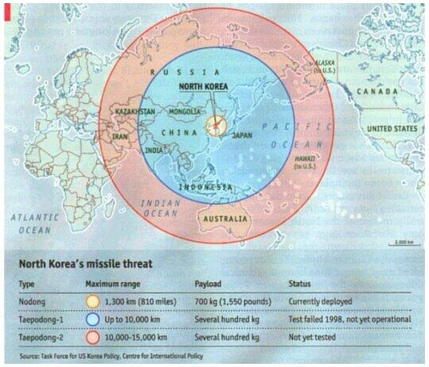
].column[
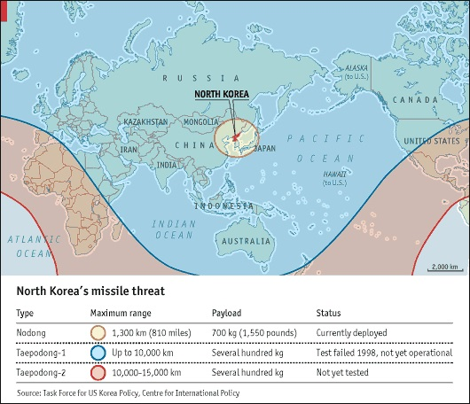
]]
.footnote[[Maps](https://georeferenced.wordpress.com/2014/05/22/worldmapblunders/), [ArcUser Online Discussion](https://www.esri.com/news/arcuser/0111/geodesic.html)]

---
class: center, middle

### The Shortest Route
.split-50[.column[
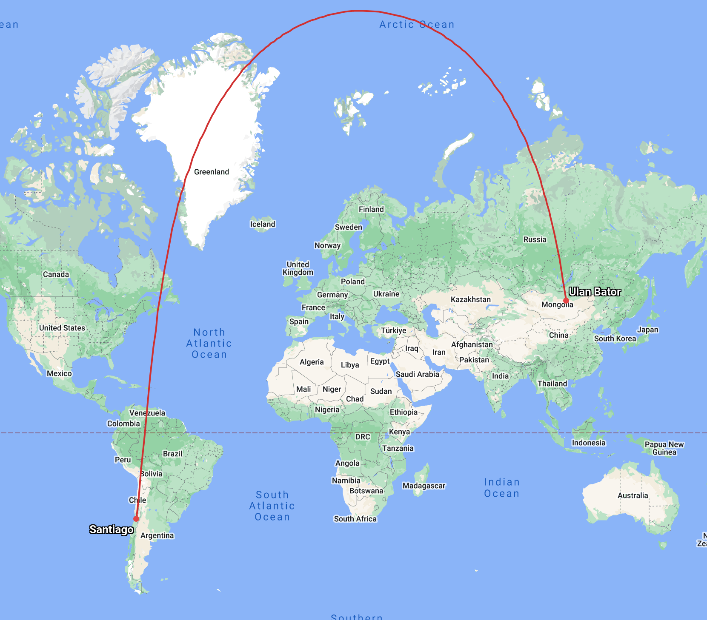
].column[
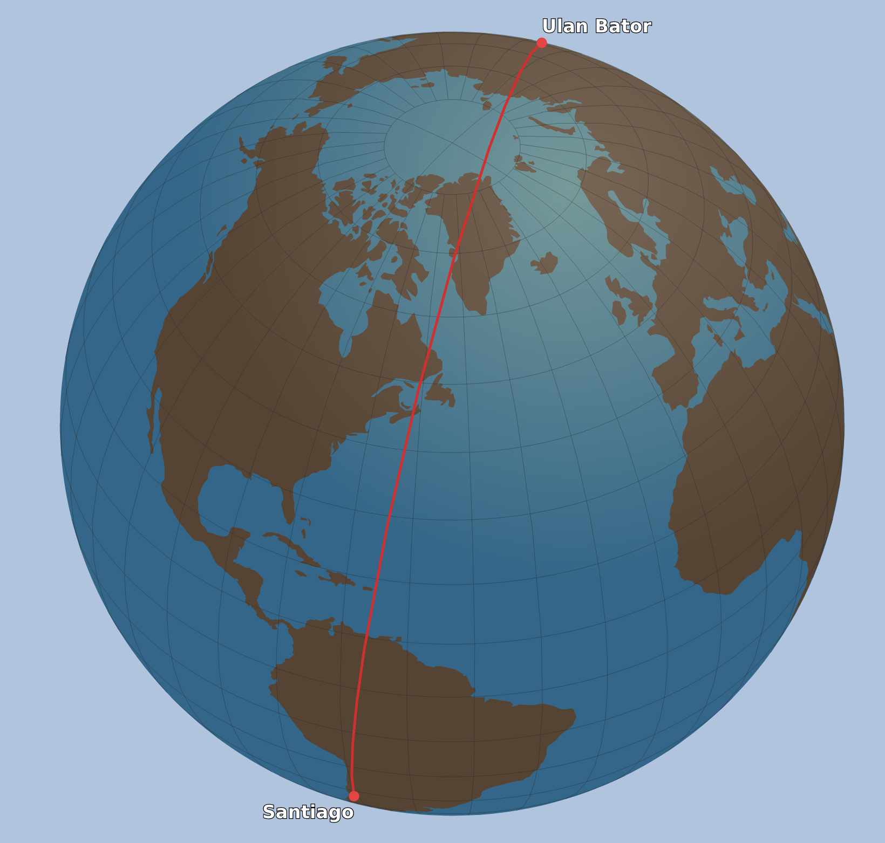
]]
.footnote[[Great Circle Map](https://www.greatcirclemap.com/?routes=SCL-ULN)]

---
class: center, middle, inverse

## The Geographic Coordinate System
------
.wide[ Geoid .dot[] Ellipsoid .dot[] Datum ]

---
class: center, middle
### From Geographic Phenomenon to Map
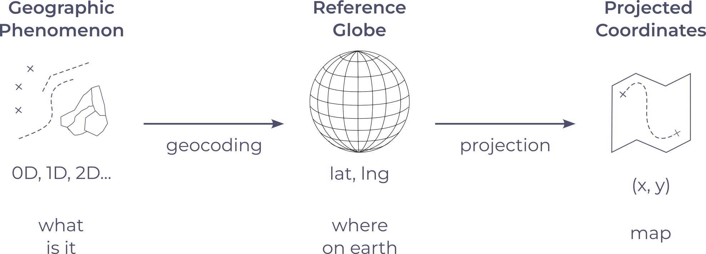

---
class: left, middle

.split-20[.column[
### Reference Globe
- Geoid
].column[
The geoid is defined as the surface of the earth's gravity field, which is approximately the same as .bold[Mean Sea Level (MSL)]. It is perpendicular to the direction of gravity pull. Since the mass of the earth is not uniform at all points, and the direction of gravity changes, the shape of the geoid is irregular. 

A hypothetical surface representing the form the earth's oceans would take if there were no land and the water were free to respond to the earth's gravitational and centrifugal forces. The resulting geoid is irregular and .bold[varies from a perfect sphere] by as much as 75 meters above and 100 meters below its surface. [ArcUser Online](http://www.esri.com/news/arcuser/0703/geoid1of3.html)

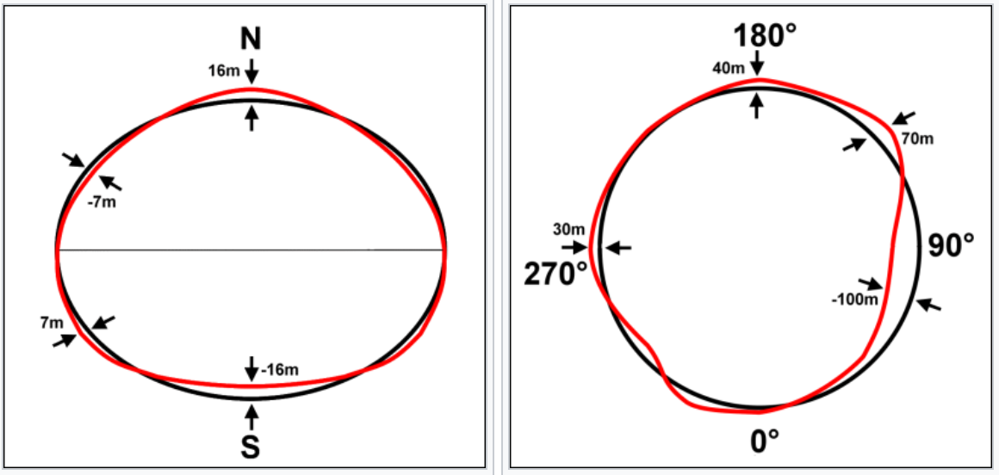  
Geoid (red) view from equator (left) and north pole (right).
]]

---
class: left, middle

.split-20[.column[
### Reference Globe
- Geoid
].column[
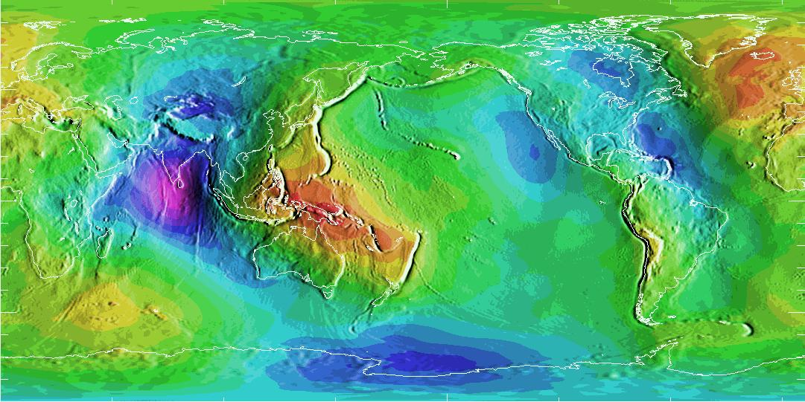  
[Geoid Height, Global WGS-84/EGM96 grid](https://geodesy.noaa.gov/GEOID/GEOID96/geo-indx.html)

]]

---
class: left, middle

.split-20[.column[
### Reference Globe
- Geoid
- Ellipsoid
].column[
Ellipsoid/Spheroid – a mathematical approximation of the Earth’s shape from the Geoid. 

.split-60[.column[
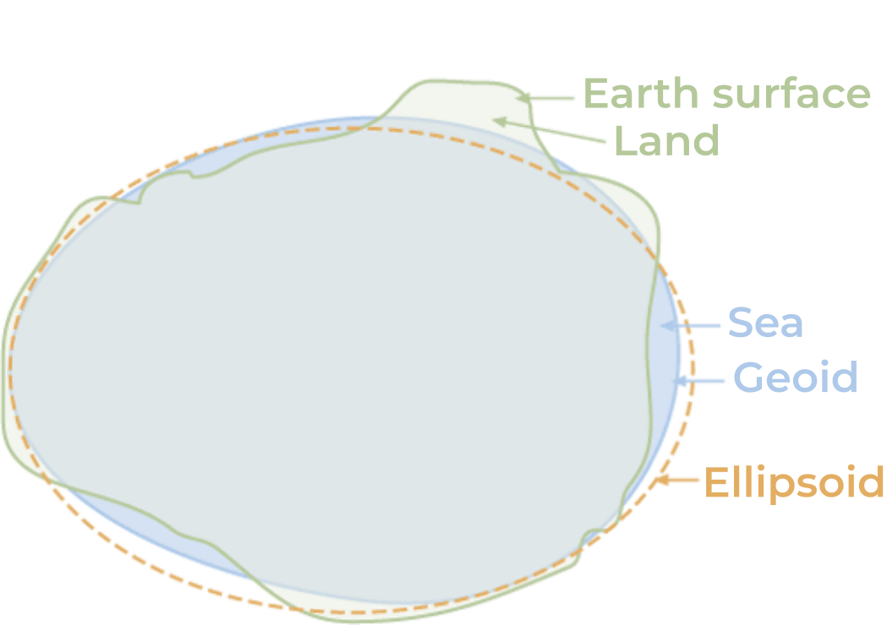 

].column[
 

]]]]

---
class: left, middle

.split-20[.column[
### Reference Globe
- Geoid
- Ellipsoid
].column[
#### Example of ellipsoid/spheroid table
 

.footnote-right[[Table Link](https://desktop.arcgis.com/en/arcmap/latest/map/projections/about-the-geoid-ellipsoid-spheroid-and-datum-and-h.htm)]

]]

---
class: left, middle

.split-20[.column[
### Reference Globe
- Geoid
- Ellipsoid
- Datum
].column[
 

]]

---
class: left, middle

.split-20[.column[
### Reference Globe
- Geoid
- Ellipsoid
- Datum
].column[
#### Global Datum

While a spheroid approximates the shape of the earth, a datum defines the position of the spheroid relative to the center of the earth. A datum provides a frame of reference for measuring locations on the surface of the earth. It defines the origin and orientation of latitude and longitude lines.

.split-50[.column[
 
].column[
WGS84: 
- semi-major axis (equatorial)  
  = 6378137.0 m
- semi-minor axis (polar):  
  = 6356752.3 m
- mean Earth radii  
  $\approx$ 6371008.8 m
- origin: center of the earth  
- [EPSG:4326](https://epsg.io/4326)
]]
.footnote-right[[Some materials](https://gisgeography.com/ellipsoid-oblate-spheroid-earth/)]

]]

---
class: left, middle

.split-20[.column[
### Reference Globe
- Geoid
- Ellipsoid
- Datum
].column[
#### Geographic Coordinate System

 

]]

---
class: left, middle

.split-20[.column[
### Reference Globe
- Geoid
- Ellipsoid
- Datum
].column[
#### Geographic Coordinate System

 

]]

---
class: left, middle

.split-20[.column[
### Reference Globe
- Geoid
- Ellipsoid
- Datum
].column[
#### Global Datum vs. Local Datum

 

.footnote-right[[Description of Datums from ESRI](https://desktop.arcgis.com/en/arcmap/latest/map/projections/datums.htm#GUID-E49F0E1B-8F0D-4704-8384-735EA002FDDC)]

]]

---
class: left, middle

.split-20[.column[
### Reference Globe
- Geoid
- Ellipsoid
- Datum
].column[
#### Local Datum

Changing the datum, or more correctly, the geographic coordinate system, will result in different coordinates of the same geometry. E.g., for a point in Redlands, California:

 

.footnote-right[[Description of Datums from ESRI](https://desktop.arcgis.com/en/arcmap/latest/map/projections/datums.htm#GUID-E49F0E1B-8F0D-4704-8384-735EA002FDDC)]

]]

---
class: left, middle

.split-20[.column[
### Reference Globe
- Geoid
- Ellipsoid
- Datum
].column[
#### Singapore Datum

SVY21 ([EPSG:4757](https://epsg.io/4757)), see [SLA](https://app.sla.gov.sg/sirent/About/PlaneCoordinateSystem) for details
- since 2004
- based on WGS84
- reference point:
    - BASE7 (located at Pillar 7 Pierce Reservoir) 
    - latitude: 1° 22' 02.915414" N
    - longitude: 103° 49' 31.975227" E

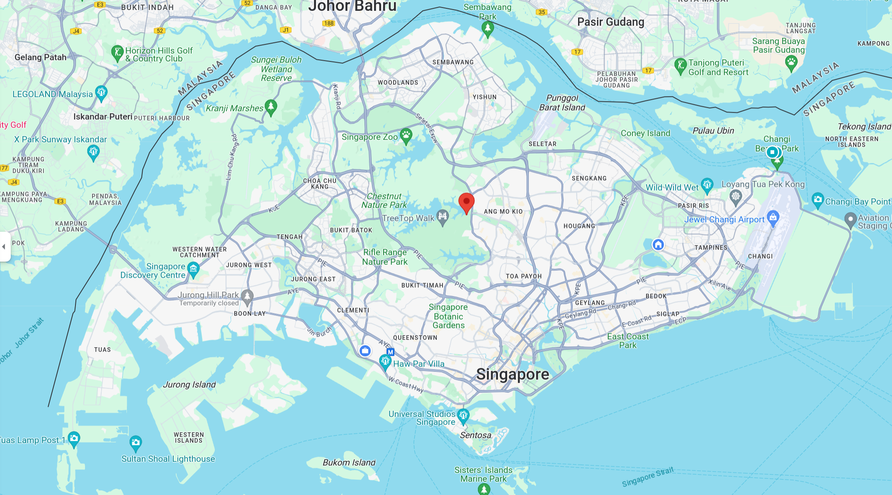 
.footnote-left[[Google Map](https://www.google.com/maps/place/1°22'02.9"N+103°49'32.0"E/@1.3499648,103.7334232,12.04z)]
]]

---
class: center, middle, inverse

## The Projected Coordinate System
------
.wide[ Point of Projection .dot[] Developable Surface .dot[] Standard Point/Line .dot[] Distortion ]

---
class: left, middle

.split-30[.column[
### What is Projection
Map projection is the systematic transformation of the curved, 3-dimensional sphere surface of the planet into flat, 2-dimensional plane.
].column[

 

]]

---
class: left, middle

.split-30[.column[
### What is Projection
Terminology

- Reference Globe
- Point of Projection
- Developable Surface
- Standard Point (Line...)

].column[

 

]]

---
class: left, middle

.split-30[.column[
### Planar Projection
Points of projection
].column[

 

]]

---
class: left, middle

.split-30[.column[
### Planar Projection
Points of projection
].column[

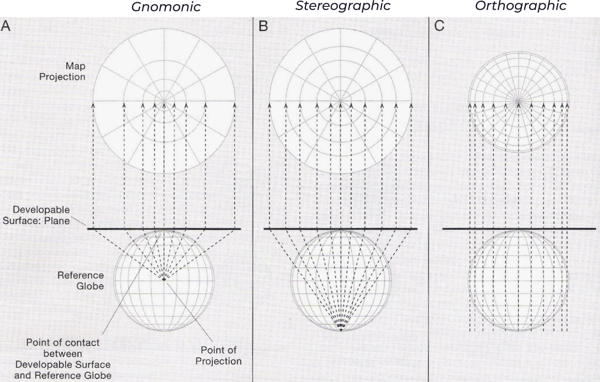 

]]

---
class: left, middle

.split-30[.column[
### Planar Projection
An example of Orthographic Projection centered at North Korea.  
The concentric circles indicate the distances (1,000km increment) from North Korea.
].column[

 

.footnote-left.small[[Distances from North Korea by Jason Davies](https://www.jasondavies.com/maps/north-korea-distance/)]

]]

---
class: left, middle

.split-30[.column[
### Types of Developable Surfaces
- a. Cylindrical
- b. Conic
- c. Planar (Azimuthal)

].column[

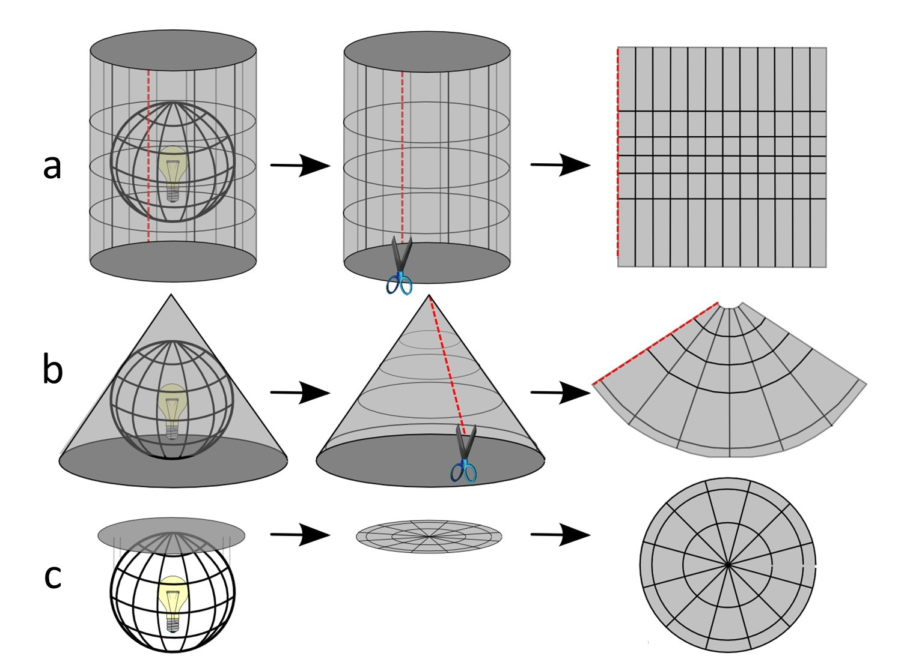 

.footnote-left.small[[Scale and Projections](https://open.lib.umn.edu/mapping/chapter/3-scale-and-projections/)]

]]

---
class: left, middle

.split-30[.column[
### Types of Developable Surfaces
- a. Cylindrical
- b. Conic
- c. Planar (Azimuthal)

red lines/points indicate the line/point of contact, i.e., standard line/point

].column[

 

.footnote-left.small[[Scale and Projections](https://open.lib.umn.edu/mapping/chapter/3-scale-and-projections/)]

]]

---
class: right, bottom
background-image: url(resources/week-03/Mercator_projection_Square.JPG)

### The Mercator Projection (Cylindrical)

.footnote-left.small[Map source: [Wikipedia](https://en.wikipedia.org/wiki/Mercator_projection), [PROJ.org](https://proj.org/en/9.3/operations/projections/merc.html)]

---
class: center, top
background-image: url(resources/week-03/Lambert_conformal_conic_a.png)

### Lambert Conformal Conic Alternative (Conical)

.footnote-left.small[Map source: [The Morphing Map Project](https://wcchin.github.io/map_projection/world_map.html), [PROJ.org](https://proj.org/en/9.3/operations/projections/lcca.html)]

---
class: left, middle

.split-30[.column[
### Aspects of Projections
The placement of the Developable Surfaces to change the standard line/point. 

A standard line is a line on a sphere or spheroid that .red[has no length compression or expansion] after being projected; usually a standard parallel or central meridian. 

].column[

 

.footnote-left.small[[ArcGIS: Projection Types](https://desktop.arcgis.com/en/arcmap/latest/map/projections/projection-types.htm)]

]]

---
class: left, middle

.split-30[.column[
### Case of Projections
- Tangent
- Secant

The line along standard line (parallel) has no compression/expansion. Adding an extra standard line would introduce more places along the standard lines that preserved, making the nearby areas to have less expansion/compression.  

].column[

 

.footnote-left.small[[Wikipedia: Secant plane](https://en.wikipedia.org/wiki/Secant_plane)]

]]

---
class: left, middle

.split-30[.column[
### Case of Projections (Secant)
- scale exaggerated (expansion)
- scale compressed 

Example of projection with secant: [Universal Tranverse Mercator](https://gisgeography.com/utm-universal-transverse-mercator-projection/). In UTM, the globe is splited by 6 degrees, i.e., into 60 North and 60 South zones. For each zone, the central meridian is the central vertical (north-south) line and the standard lines locate at 180 km away from both sides of the central line. 

].column[

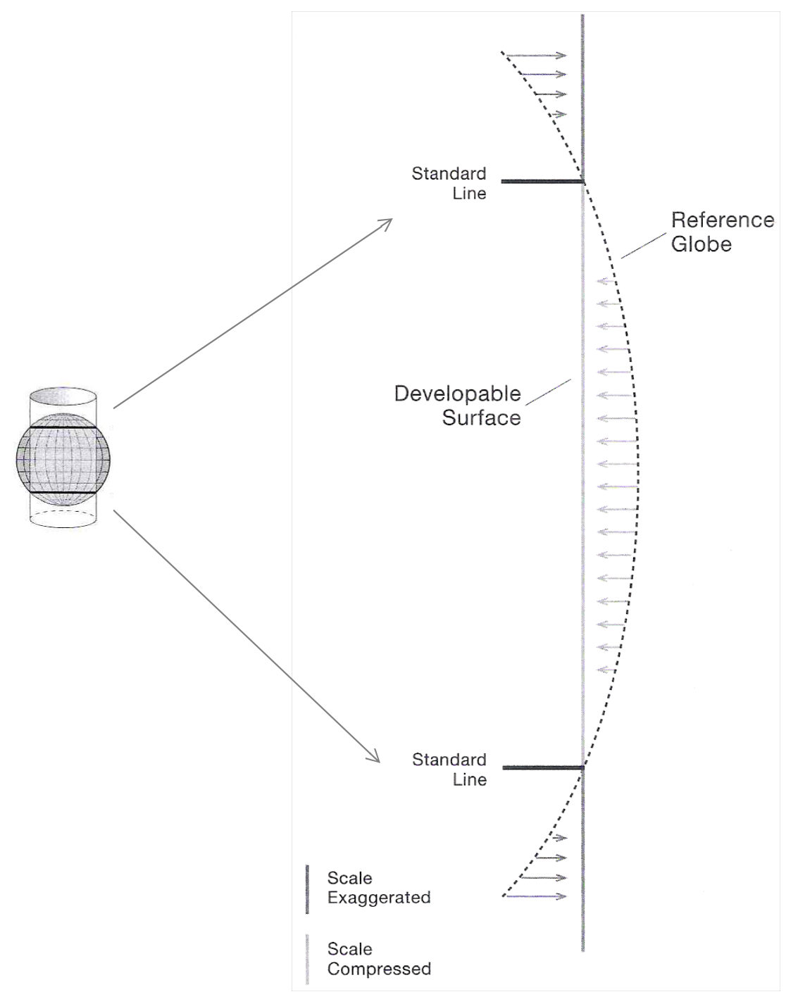 

]]

---
class: left, middle

.split-30[.column[
### Properties of Map Projections
.footnote-left.small[[Types of Map Projections](https://www.geographyrealm.com/types-map-projections/)]
].column[
- Equivalence (Equal-area):
    - preserve the correct proportions of areas
    - e.g., Albers Equal-Area Conic projection, Mollweide projection
- Conformality: 
    - maintain local angles and shapes
    - e.g., Mercator projection, Lambert Conformal Conic projection
- Equidistant projections: 
    - retain true distances from one or two points to all other points
    - e.g., Azimuthal Equidistant projection
- Azimuthal projections: 
    - preserve directions from a central point
    - e.g., some conformal projection, orthomorphic projection, azimuthal projection.
- Compromise projections: 
    - attempt to balance various distortions inherent in map projections
    - e.g., Robinson projection, Winkel Tripel projection
]]

---
class: left, middle

.split-50[.column[
### Properties of Map Projections
- Equivalence (Equal-area)
].column[

 

]]

---
class: left, middle

.split-50[.column[
### Properties of Map Projections
- Equivalence (Equal-area)
- Conformality

.footnote-left[[Wikipedia: Conformal map](https://en.wikipedia.org/wiki/Conformal_map)]
].column[

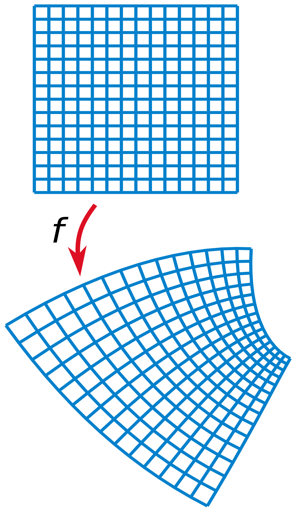 

]]

---
class: left, middle

.split-30[.column[
### Properties of Map Projections
- Equivalence (Equal-area)
- Conformality
- Equidistant & Azimuthal

Azimuthal Equidistant Projection centered at North Korea

.footnote-left.small[[Distances from North Korea by Jason Davies](https://www.jasondavies.com/maps/north-korea-distance/)]
].column[

 

]]

---
class: left, middle

.split-30[.column[
### Properties of Map Projections
- Equivalence (Equal-area)
- Conformality
- Equidistant & Azimuthal
- Compromised Projection

The Robinson projection primary purpose is to create visually appealing maps of the entire world. It does not eliminate any type of distortion, but it keeps the levels of all types of distortion relatively low over most of the map.

.footnote-left.small[[The Morphing Map Project](https://wcchin.github.io/map_projection/robinson_refline.html)]
].column[

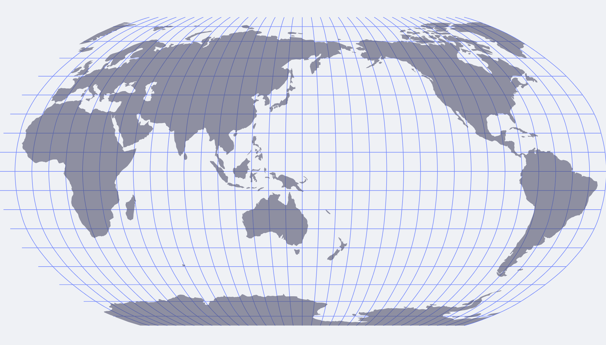   
Robinson Projection centered at 150 E.  

Compromised Projections strike a balance between the distortion in area and angle.
The combined distortion is usually less than if a single property was preserved. 
]]

---
class: left, middle

.split-30[.column[
### Tissot Indicatrix
A measurement / visualization of distortions
].column[
Tissot Indicatrix is a way to visually explore and understand distortion of different projections. 

A symbol representing a really small point on the reference globe with unit radius. 

   

]]

---
class: left, middle

.split-30[.column[
### Tissot Indicatrix
A measurement / visualization of distortions
- change in area (size)
- change in angle (orientation)

].column[

   

]]

---
class: left, middle

.split-20[.column[
### Tissot Indicatrix
- .red[Robinson]

.footnote-left.small[[The Morphing Map Project](https://wcchin.github.io/map_projection/world_map_tissot.html) | [proj.org](https://proj.org/en/9.3/operations/projections/robin.html) ]

].column[

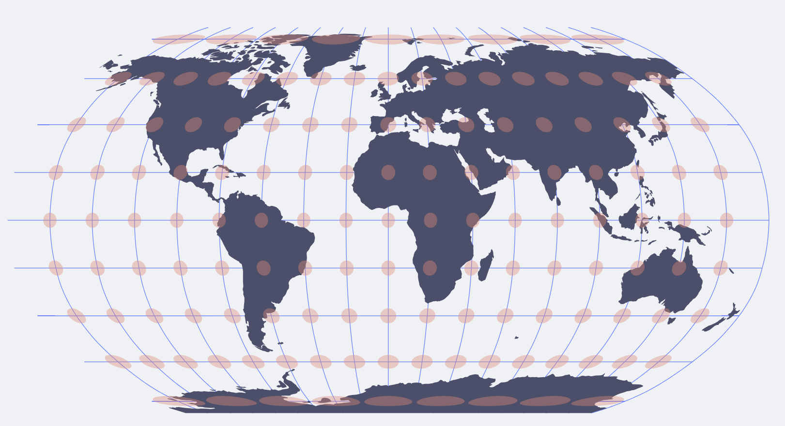   

]]

---
class: left, middle

.split-20[.column[
### Tissot Indicatrix
- Robinson
- .red[Mollweide]

.footnote-left.small[[The Morphing Map Project](https://wcchin.github.io/map_projection/world_map_tissot.html) | [proj.org](https://proj.org/en/9.3/operations/projections/moll.html) ]

].column[

   

]]

---
class: left, middle

.split-20[.column[
### Tissot Indicatrix
- Robinson
- Mollweide
- .red[Winkel Tripel]

.footnote-left.small[[The Morphing Map Project](https://wcchin.github.io/map_projection/world_map_tissot.html) | [proj.org](https://proj.org/en/9.3/operations/projections/wintri.html) ]

].column[

   

]]

---
class: left, middle

.split-20[.column[
### Tissot Indicatrix
- Robinson
- Mollweide
- Winkel Tripel
- .red[van der Grinten]

.footnote-left.small[[The Morphing Map Project](https://wcchin.github.io/map_projection/world_map_tissot.html) | [proj.org](https://proj.org/en/9.3/operations/projections/vandg.html) ]

].column[

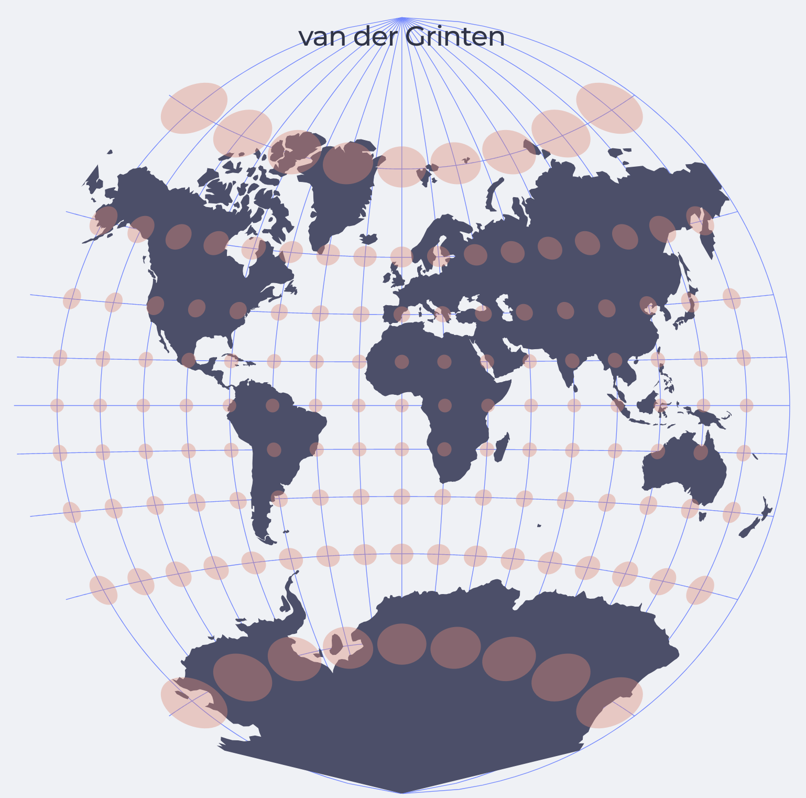   

]]

---
class: center, middle, inverse

## Choosing a Projection
------
.wide[Consideration .dot[] Local Projection ]

---
class: left, middle

.split-30[.column[
### Choosing a Projection
].column[
- Overall purpose of the map
- Geographic region and extent
- Symbolization method: dot-density? angular relationship?
- Intended audience

]]

---
class: left, middle

.split-30[.column[
### Choosing a Projection
].column[
Projection properties 
- equivalency, conformality, equidistance, azimuthality
- Suitable to the map’s purpose?
- Which ones must be .red[preserved], and which can be .red[sacrificed]? 
- Or, is .red[compromise] of all for the best choice?

Characteristics 
- e.g. constant scale, interrupted, centered on a city

Deformational patterns across mapped area
- Is .red[amount and location] of deformation acceptable?

Projection center
- Can the projection be .red[centered] easily on the mapped area?

Familiarity
- Is appearance .red[recognizable] to map reader or will it confuse?

]]

---
class: center, middle

#### Ecological Value, Korea in the World: an example

   

.footnote-right[[Ecological Value, Korea in the World](http://nationalatlas.ngii.go.kr/pages/page_2318.php#prettyPhoto)]

---
class: center, middle

#### Early human migrations according to mitochondrial population genetics 

   
(numbers are millennia before present)

.footnote-left.small[[Wikipedia: Dymaxion Map/Fuller Map](https://en.wikipedia.org/wiki/Dymaxion_map), [This Is The Most Accurate Flat Map Of Earth](https://www.iflscience.com/this-is-the-most-accurate-flat-map-of-earth-72602), [AuthaGraph](http://www.authagraph.com/projects/description/%E3%80%90%E4%BD%9C%E5%93%81%E8%A7%A3%E8%AA%AC%E3%80%91%E8%A8%98%E4%BA%8B01/?lang=en), [This Weird Globe-Folding Map Isn't Perfect, But It's Close](https://www.wired.com/2016/11/weird-globe-folding-map-isnt-perfect-close/)]

---
class: left, middle

.split-30[.column[
### For National,  Regional or Local Area

The shape of the area/extent is a key point to decide the projections. 

].column[
   
]]

---
class: left, middle

.split-30[.column[
### For Singapore

].column[
#### SVY21 / Singapore TM

- Projection: Tranverse Mercator
- Origin: 103° 50' 00 E, 1° 22' 00" N
- False Origin ( Easting ): 28001.642 m
- False Origin ( Northing ): 38744.572 m
- Scale Factor at Central Meridian: 1.00000000
- [EPSG: 3414](https://epsg.io/3414)
- [SLA link](https://app.sla.gov.sg/sirent/About/PlaneCoordinateSystem)
- PROJ.4 string: 
    - `+proj=tmerc +lat_0=1.36666666666667 +lon_0=103.833333333333 +k=1 +x_0=28001.642 +y_0=38744.572 +ellps=WGS84 +towgs84=0,0,0,0,0,0,0 +units=m +no_defs +type=crs`

]]

---
class: left, middle

.split-30[.column[
### False Origin

].column[
   
The origin point is the central point of the projection grid system where all points are referenced. The false origin differs from the true origin in order to exclude negative values from the coordinates. A false easting and northing are used to prevent the use of negative numbers. 

The distortion/scale factors would not be affected by the false origin settings. 
]]

---
class: center, middle
### In summary

